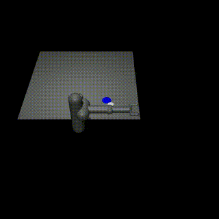
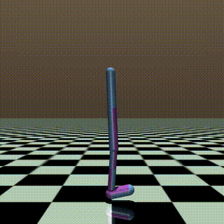
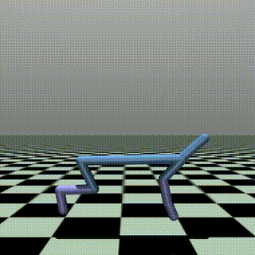

# Policy Gradient Methods
A collection of policy gradient methods to solve the mujoco environments


# Table of Contents

- [How to install](#how-to-install)
- [How to run](#how-to-run)
- [Results](#results)

# How to install
```
git clone https://github.com/devabz/DeepRLv2.git
cd DeepRLv2
conda env create --file environment.yml
conda activate DeepRLv2
```

# How to run
```
python train.py --config ./path/to/agent/config.json --logdir ./path/to/logdir [--env]
```
### Example
```
python train.py --env Walker2d-v4 --config templates/td3.json --logdir logs
```


# Components

## Algorithm
- Deep Delayed Policy Gradient (DDPG) 
- Twin Delayed DDPG (TD3)
- Soft Actor-Critic (SAC)
- Proximal Policy Optimization (PPO)

## Memory
- Experience Replay (ER)
- Prioritized Experience Replay (PER)
- Hindsight Experience Replay (HER)

## Trainer

# Optimizations
## Vectorized PER
## Parallelized Testing


# Results

<table style="width:100%;">
  <tr>
    <th></th>
    <th>DDPG</th>
    <th>TD3</th>
    <th>SAC</th>
    <th>PPO</th>
  </tr>
  <tr>
    <th>Pusher-v4</th>
    <td></td>
    <td></td>
    <td></td>
    <td></td>
  </tr>
  <tr>
    <th>Hopper-v4</th>
    <td></td>
    <td></td>
    <td></td>
    <td></td>
  </tr>
  <tr>
    <th>Humaoid-v4</th>
    <td></td>
    <td></td>
    <td></td>
    <td></td>
  </tr>
  <tr>
    <th>Walker2D-v4</th>
    <td></td>
    <td></td>
    <td></td>
    <td></td>
  </tr>
  <tr>
    <th>Ant-v4</th>
    <td></td>
    <td></td>
    <td></td>
    <td></td>
  </tr>
  <tr>
    <th>HalfCheetah-v4</th>
    <td></td>
    <td></td>
    <td></td>
    <td></td>
  </tr>
</table>

